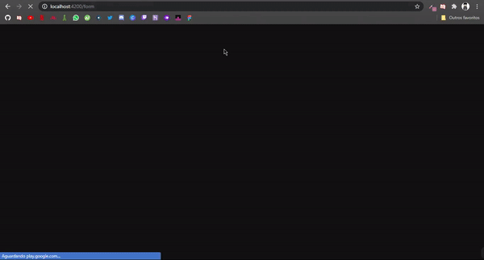

# Angular Form

## Table of Contents

* [About the Project](#about-the-project)
  * [Built With](#computer-built-with)
* [Getting Started](#getting-started)
* [Meta](#meta)

---

<!-- ABOUT THE PROJECT -->
## About The Project

#### I developed this project to understand how Angular Material works



---

## :computer: Built With

Main technologies used in the project

* Typescript  
* HTML CSS
* AngularJs    
* Angular Material

---

<!-- GETTING STARTED -->
# Getting Started

```bash
# Clone Repository
$ git clone https://github.com/Lucas-Vinicius-Santos/Angular-Form.git

# Install Dependencies
$ npm install

# Run Aplication
$ ng start
```
:eyes: Go to http://localhost:4200/ to see the result.

---

## Meta

Lucas Santos – [](https://www.linkedin.com/in/lucas-santos-4519aa1b0/) 
| 
[](mailto:lucasparaipaba113@gmail.com)

This project is under the [MIT license](./LICENSE).

[https://github.com/Lucas-Vinicius-Santos/github-link](https://github.com/Lucas-Vinicius-Santos)

